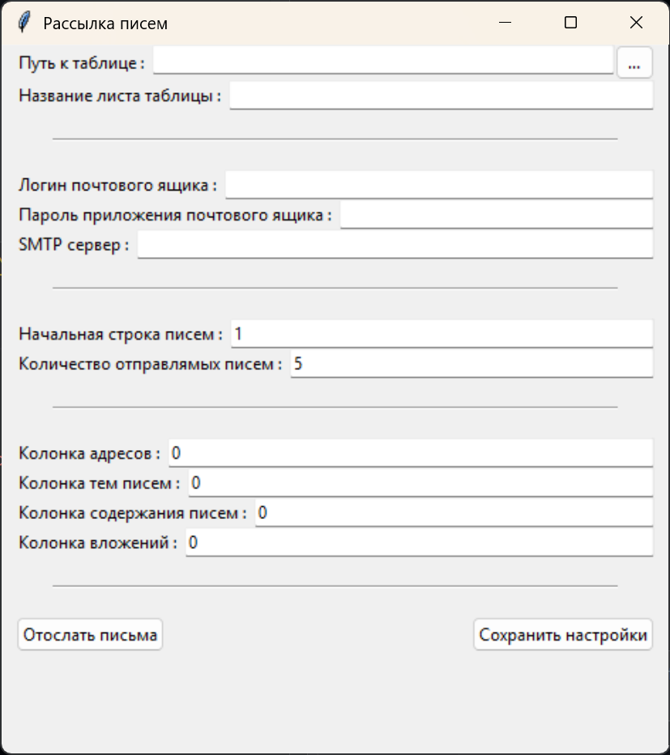

# Рассылка писем из таблиц

Программа для рассылки писем из таблиц Excel. Изначально предназначалась для урощенной рассылки писем для поступающих школьников в школу. Реализация 2022 года.

Функционал у современных электронных таблиц широкий и гибкий. Человеку, знакомому с таблицами, будет несложно распределить темы, содержание и возможные вложения в письма по адресатам. Данная программа позволяет разослать сформированные в таблицах письма большому числу человек.

### Реализованный функционал:

* выбор используемого SMTP сервера
* вход в почтовый ящик через приложение
* вложения в письма
* предупреждения о конкретных ошибках
* отображение ошибках по письмам в исходной таблице
